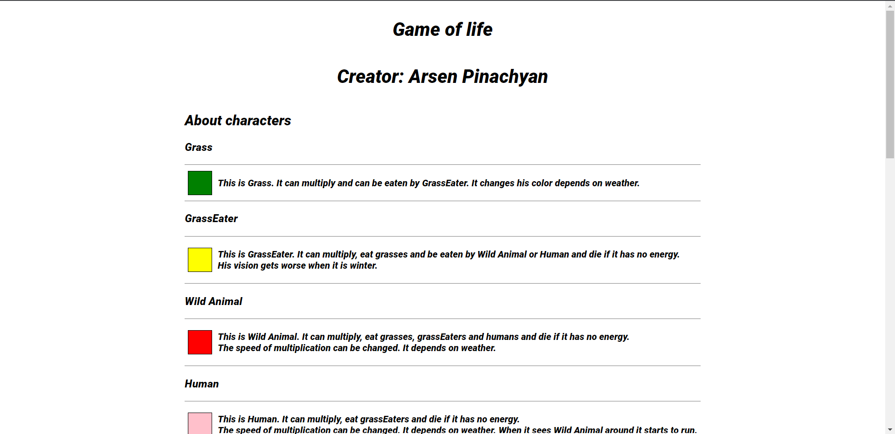
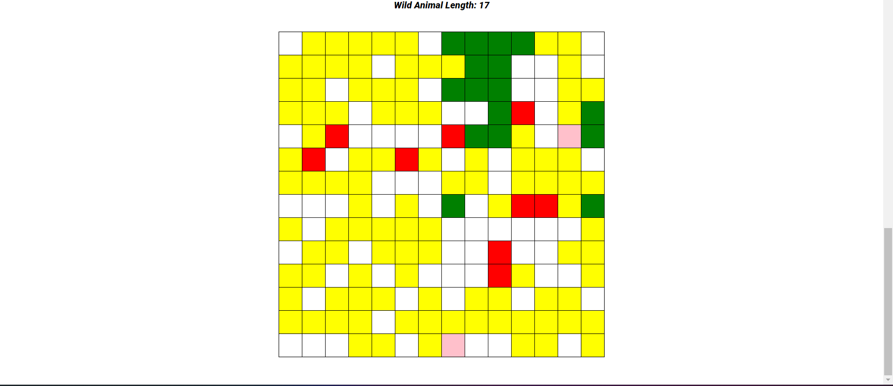
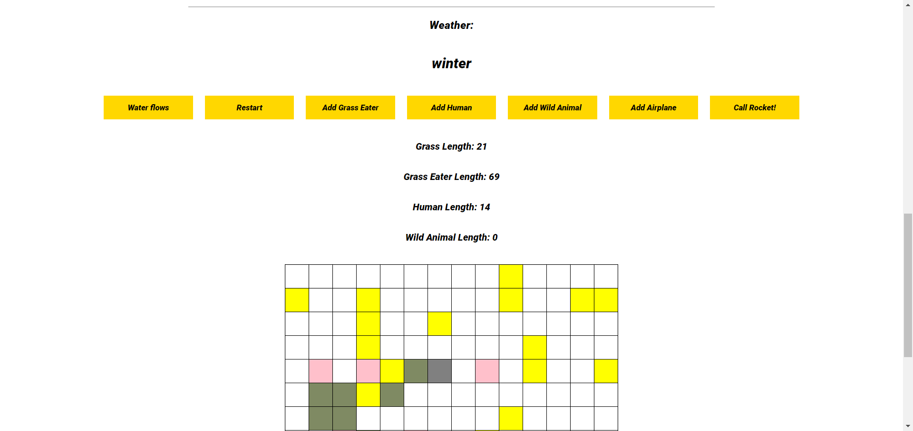

# 🎮 Game of Life Simulator

A **Game of Life Simulator** developed as part of a **JavaScript OOP course**. The project simulates a 2D pixel-based world where different characters move, eat, and survive according to randomly generated behaviors.

The application also demonstrates the use of **JSON files for data management** and **Node.js for server-side functionality**.

## ✨ Features

* 🧩 Object-Oriented Programming with JavaScript
* 🌍 2D pixel-based simulated world
* 🐾 Characters with different behaviors
* 🎲 Randomly generated actions and interactions
* 📄 JSON-based data management
* 🖥️ Node.js server
* 🌐 Browser-based GUI

## 🛠️ Technologies

* **JavaScript**
* **Node.js**
* **JSON**
* **HTML/CSS**

## 🚀 How to Run

### 1. Clone the repository

```bash
git clone <repository-url>
cd <project-folder>
```

### 2. Install dependencies

```bash
npm install
```

### 3. Start the server

```bash
npm start
```

The `npm start` command automatically launches the `server.js` file configured in `package.json`.

### 4. Open the application

Once the server is running, open your browser and go to:

```text
http://localhost:3000
```

You can then interact with the Game of Life Simulator through the GUI.

## 🎥 Demo

[▶️ Watch the project demonstration](https://drive.google.com/file/d/1iAAc4B8Gk08Fmennmqx-BRkMV1ivge3T/view?usp=sharing)

## 📸 Screenshots







## 📚 About the Project

This project was created to apply **Object-Oriented Programming concepts in JavaScript** in a practical application. It combines a graphical interface, randomized character behavior, JSON data handling, and a Node.js server into an interactive simulation.
